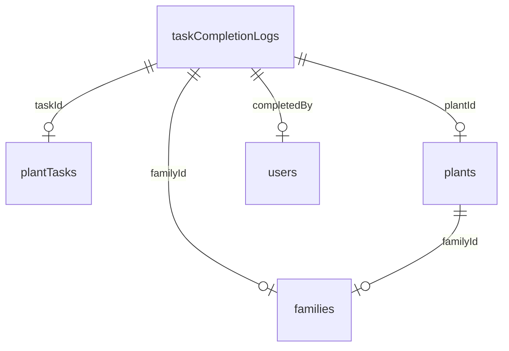
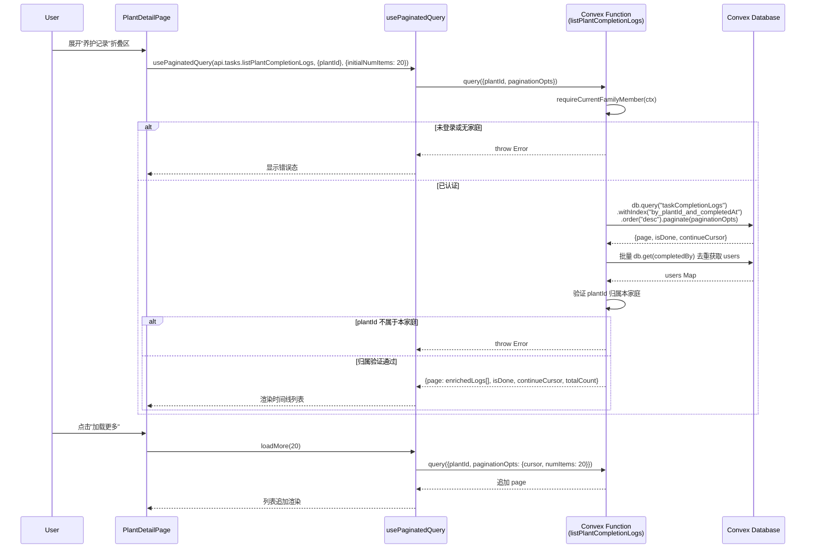
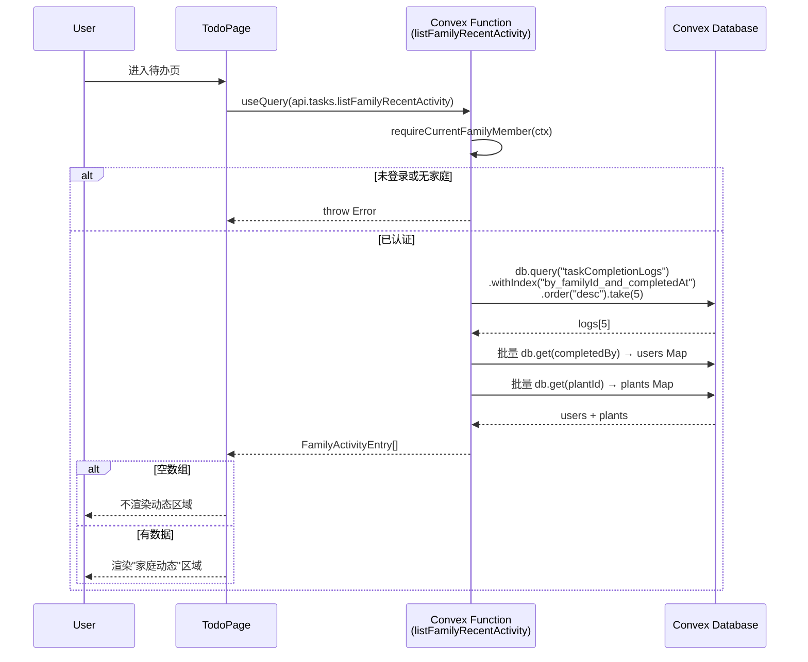
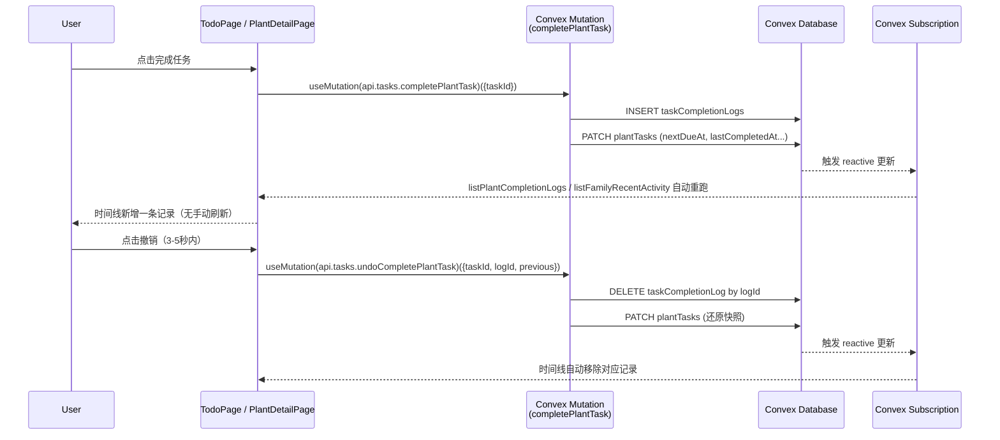
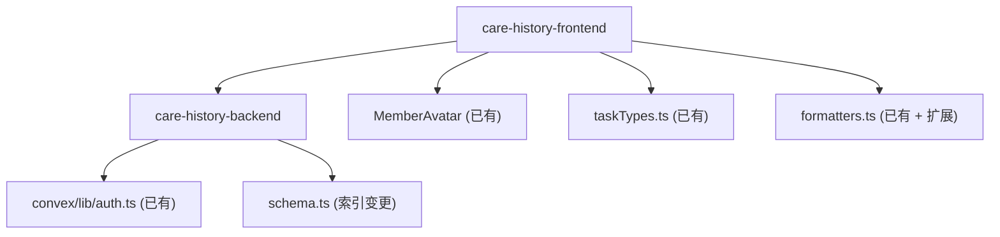

# 养护历史时间线 — 技术方案

## 方案概述

| 项目 | 内容 |
|------|------|
| 项目名称 | 养护历史时间线（Care History Timeline） |
| 方案版本 | v1.0 |
| 对应 PRD | `docs/product-specs/2026-06-17-care-history-timeline-spec.md` |
| 技术栈概要 | React + Vite + Convex（与现有全栈架构一致，无新增依赖） |
| 核心挑战 | 1. cursor-based 分页在 Convex 实时订阅下的正确实现（避免 offset 分页与 reactive 冲突）；2. 跨表 join（completionLogs → users / plants）在 Convex 无原生 JOIN 下的高效拼装 |
| 预计工期估算 | 后端 2 个 Task，前端 3-4 个 Task，共 5-6 个 Task |

---

## 技术选型

本次迭代在已有技术栈内工作，不引入新框架/库/第三方服务。以下为本次需要做的增量技术决策：

| 决策项 | 选型 | 备选方案 | 淘汰原因 |
|--------|------|---------|----------|
| 分页策略 | cursor-based 分页（Convex `.paginate()`） | offset-based 分页 | Convex 官方推荐 cursor 模式，对实时订阅友好；offset 在有新数据写入时会导致跳页/重复（PRD D5） |
| 跨表关联 | 应用层手动 join（query 内批量 `ctx.db.get`） | Convex 不支持 SQL-style JOIN | 唯一可行方式；用 Map 缓存去重减少重复查询 |
| 相对时间格式化 | 自建 `formatRelativeTime()` 工具函数 | date-fns / dayjs | 项目已有 `formatters.ts` 范式，需求仅覆盖"刚刚/N分钟前/N小时前/日期"四档，无需引入新依赖 |
| 成员头像渲染 | 复用现有 `MemberAvatar` 组件 | 新建组件 | `MemberAvatar` 已实现三层渲染（真实头像→首字母→兜底图标），完全满足需求 |
| 任务类型图标 | 复用 `getTaskTypeIcon()` + `taskTypeColorVar()` | 新建图标映射 | `taskTypes.ts` 已是任务类型图标权威来源（ICON-003 约束） |
| 折叠区组件 | 新建 `CollapsibleSection` 或复用现有折叠模式 | 第三方 Accordion | 植物详情页 `PlantManagementSection` 已有折叠逻辑可参考，保持视觉一致 |

---

## 数据模型

### 现有表结构（无变更）

本次迭代**不修改任何现有表结构**（PRD D4）。`taskCompletionLogs` 表已有字段完全覆盖时间线需求：

```typescript
// app/convex/lib/validators.ts — taskCompletionLogFields（现有，不修改）
export const taskCompletionLogFields = {
  taskId: v.id("plantTasks"),     // 关联养护任务
  plantId: v.id("plants"),        // 关联植物（冗余，免二次查询）
  familyId: v.id("families"),     // 家庭隔离键
  completedBy: v.id("users"),     // 完成人（需 join users 表获取昵称/头像）
  completedAt: utcTimestampValidator, // UTC 完成时间戳
  taskType: plantTaskTypeValidator,   // 任务类型（watering/fertilizing/...）
  intervalDays: v.number(),       // 完成时的养护间隔天数（快照）
};
```

### 新增索引

```typescript
// app/convex/schema.ts — taskCompletionLogs 表新增索引
taskCompletionLogs: defineTable(taskCompletionLogFields)
  .index("by_taskId", ["taskId"])                               // 已有
  .index("by_familyId_and_completedAt", ["familyId", "completedAt"]) // 已有
  .index("by_plantId_and_completedAt", ["plantId", "completedAt"]),  // 【新增】
```

| 索引名 | 字段 | 类型 | 理由 |
|--------|------|------|------|
| `by_plantId_and_completedAt` | `["plantId", "completedAt"]` | 复合索引 | 支持植物详情页按 plantId 过滤 + completedAt 降序的时间线查询；无此索引会全表扫描 |

### 表关系



### 前端状态模型（新增类型）

```typescript
// app/src/types/domain.ts — 新增

/** 单条养护完成记录（植物维度时间线） */
export interface PlantCompletionLogEntry {
  logId: Id<"taskCompletionLogs">;
  taskType: CareTaskType;
  completedByName: string;           // join users.displayName ?? users.name
  completedByImageStorageId: string | null; // join users.imageStorageId
  completedAt: number;               // UTC timestamp
}

/** listPlantCompletionLogs 返回结构 */
export interface PlantCompletionLogsResult {
  logs: PlantCompletionLogEntry[];
  totalCount: number;
  isDone: boolean;                   // 是否已加载全部
  continueCursor: string | null;     // Convex paginate cursor
}

/** 单条家庭动态记录（待办页维度） */
export interface FamilyActivityEntry {
  logId: Id<"taskCompletionLogs">;
  taskType: CareTaskType;
  completedByName: string;
  completedByImageStorageId: string | null;
  plantName: string;                 // join plants.name
  completedAt: number;
}
```

### Server State vs Client State 边界

| 数据 | 归属 | 管理方式 | 理由 |
|------|------|---------|------|
| 植物养护记录列表 | Server State | Convex `useQuery` / `usePaginatedQuery` | 来自后端实时订阅，撤销完成时自动移除 |
| 家庭最近动态 | Server State | Convex `useQuery` | 轻量查询，5 条固定 limit，不需分页 |
| 折叠区展开/收起状态 | Local State | `useState` | 纯 UI 状态，不需跨组件共享 |
| "加载更多"按钮 loading 态 | Local State | `useState` | 组件内部交互态 |

---

## 核心业务流程

### 流程 1：植物详情页加载养护记录



### 流程 2：待办页加载家庭最近动态



### 流程 3：完成/撤销任务 → 时间线自动更新



---

## 模块边界与依赖关系

### 模块划分

| 模块名 | 职责 | 对外暴露接口 | 依赖 |
|--------|------|------------|------|
| care-history-backend | 两个新 query：按植物维度的分页时间线 + 按家庭维度的最近动态 | `api.tasks.listPlantCompletionLogs`、`api.tasks.listFamilyRecentActivity` | `convex/lib/auth.ts`（认证）、`convex/lib/validators.ts`（类型） |
| care-history-frontend | 植物详情页养护记录折叠区 + 待办页家庭动态区 + 相对时间工具函数 | `CareHistorySection`（组件）、`FamilyRecentActivity`（组件）、`formatRelativeTime()`（工具） | `MemberAvatar`、`getTaskTypeIcon()`、`taskTypeColorVar()`、`formatters.ts` |

### 模块依赖图



### 跨模块调用规则

- 后端 query 文件位置：**追加到现有 `convex/tasks.ts`**（而非新建文件），因为养护记录属于 tasks 领域
- 前端组件文件位置：植物详情养护记录区归 `src/features/plants/`，待办页动态区归 `src/features/tasks/`
- 工具函数 `formatRelativeTime` 放在 `src/lib/formatters.ts`，作为通用日期格式化的扩展
- 前端组件通过 Convex `useQuery` / `usePaginatedQuery` 直接调用后端 query，不增加中间 Hook 抽象层（保持与现有模式一致）

---

## API 契约概要

### 全局约定

| 约定项 | 规则 |
|--------|------|
| 调用方式 | Convex SDK `useQuery()` / `usePaginatedQuery()` |
| 认证方式 | Convex Auth（ctx.auth.getUserIdentity） |
| 权限校验 | 所有 query 必须通过 `requireCurrentFamilyMember(ctx)` 校验家庭归属 |
| 数据隔离 | 所有查询结果限定在当前用户的 familyId 下 |
| 时间格式 | UTC 时间戳（`number`），前端渲染为本地时区 |

### API 清单

| 模块 | 函数类型 | 函数名 | 简述 | 鉴权 |
|------|---------|--------|------|------|
| tasks | query | `listPlantCompletionLogs` | 按 plantId 分页返回养护完成记录，join users 表返回完成人信息 | 家庭成员 |
| tasks | query | `listFamilyRecentActivity` | 按 familyId 返回最近 N 条全家庭养护动态，join users + plants 表 | 家庭成员 |

### 接口详细契约

#### `listPlantCompletionLogs`

```typescript
// 参数
args: {
  plantId: v.id("plants"),
  paginationOpts: paginationOptsValidator,  // Convex 内置分页参数
}

// 返回值
returns: {
  page: Array<{
    logId: Id<"taskCompletionLogs">,
    taskType: CareTaskType,
    customLabel: string | null,             // 自定义任务名
    completedByName: string,                // 完成人昵称（displayName ?? name ?? "未知成员"）
    completedByImageStorageId: Id<"_storage"> | null,
    completedAt: number,                    // UTC timestamp
  }>,
  totalCount: number,                       // 该植物的总完成次数
  isDone: boolean,                          // Convex 分页标识
  continueCursor: string,                   // Convex 分页游标
}
```

**业务规则**：

- plantId 必须属于当前用户的家庭，否则 throw Error
- 已归档的植物仍可查看历史记录（不过滤 isArchived）
- completedBy 对应的用户已离开家庭时，仍正常显示其昵称/头像（数据来自 users 表快照，不检查 familyMembers 归属）
- totalCount 通过独立的 count query 或 `.collect().length` 获取（注意性能，见风险评估）

#### `listFamilyRecentActivity`

```typescript
// 参数
args: {}  // familyId 从 ctx 获取，无需客户端传入

// 返回值
returns: Array<{
  logId: Id<"taskCompletionLogs">,
  taskType: CareTaskType,
  customLabel: string | null,
  completedByName: string,
  completedByImageStorageId: Id<"_storage"> | null,
  plantName: string,                        // 关联植物名称
  plantId: Id<"plants">,                    // 关联植物 ID（可跳转）
  completedAt: number,
}>
```

**业务规则**：

- 固定返回最近 5 条（PRD D6），不做分页
- 对应的植物已被删除时，该条记录仍展示（plantName 降级为"已删除的植物"）
- 对应的植物已归档时，正常展示植物名称
- 空数组时前端不渲染该区域

---

## 非功能性约束

### 性能目标

| 指标 | 目标值 | 测量方式 |
|------|--------|---------|
| `listPlantCompletionLogs` 首页响应 | ≤ 100ms | Convex Dashboard function logs |
| `listFamilyRecentActivity` 响应 | ≤ 80ms | Convex Dashboard function logs |
| 新增索引带来的写入开销 | 可忽略 | taskCompletionLogs 写入频率极低（用户完成任务时才写入），一天最多几十条 |
| 前端首次渲染养护记录区 | ≤ 200ms（折叠区展开后） | Chrome DevTools Performance |
| "加载更多"追加渲染 | ≤ 150ms | 用户感知无明显卡顿 |

### 安全要求

| 类型 | 具体要求 |
|------|---------|
| 数据隔离 | 两个 query 都必须以 `familyId` 做过滤，禁止返回跨家庭数据（SECURITY.md P0） |
| plantId 归属验证 | `listPlantCompletionLogs` 必须验证 plantId 对应植物属于当前用户家庭 |
| 用户信息泄露 | 只返回 displayName 和 imageStorageId，不返回 email / phone 等敏感字段 |
| 认证前置 | 两个 query 入口都必须调用 `requireCurrentFamilyMember(ctx)` |

### 可用性要求

| 项目 | 要求 |
|------|------|
| 离线降级 | 养护记录区在离线时显示 loading 态（Convex query 挂起），不展示错误；恢复在线后自动加载 |
| 空状态 | 植物无记录时折叠标题显示"养护记录（0）"，展开显示友好文案 |
| 实时性 | 完成/撤销任务后时间线自动更新（Convex reactive，无需手动刷新） |

### 可观测性

| 层面 | 方案 |
|------|------|
| 后端 | Convex Dashboard 自带 function logs / error tracking |
| 前端 | 现有 console.error 模式（MVP 阶段无额外埋点需求） |

---

## 风险评估

| 风险 | 概率 | 影响 | 缓解措施 | 降级方案 |
|------|------|------|---------|---------|
| `totalCount` 计算性能问题：当单株植物完成记录 > 1000 条时，`.collect().length` 全量拉取代价大 | 低（家庭应用场景下单株记录量小） | 中（query 延迟上升） | 先用 `.collect().length` 实现；若后续出现性能问题，改为 Convex aggregate 或缓存计数 | 移除 totalCount，标题改为"养护记录"不带计数 |
| 离开家庭的成员 user 记录被删除 | 极低（当前实现 leaveFamily 不删 users 表） | 低（`db.get(completedBy)` 返回 null） | query 层对 null user 做兜底：名称显示"未知成员"，头像用 MemberAvatar 默认态 | 无需额外降级 |
| Convex `usePaginatedQuery` 与折叠区交互：折叠时是否仍维持订阅 | 中（首次使用分页 query） | 低（多余的订阅消耗带宽） | 折叠区展开时才挂载分页 query 组件（条件渲染），收起时卸载以释放订阅 | 始终订阅也可接受，数据量小 |
| 新增索引部署风险 | 低 | 低 | `npx convex dev --once --typecheck enable` 一次性推送，Convex 自动回填索引 | 索引回填是后台异步的，不影响服务 |

### 已知技术债（提前标记）

| 债务描述 | 产生原因 | 计划偿还时机 |
|---------|---------|------------|
| `totalCount` 使用 `.collect().length` 全量拉取 | Convex 无原生 COUNT 聚合；MVP 阶段数据量小 | 数据量 > 500 条/植物时，引入 aggregate 辅助表或 Convex 组件 |
| 相对时间格式化无 i18n | 当前硬编码中文（"刚刚"/"分钟前"等） | 国际化需求出现时抽取为 locale 配置 |
| 养护记录无按任务类型筛选 | PRD 明确标注为后续候选（§8） | v1.1 迭代 |

---

## 前端组件设计

### 新增组件清单

| 组件 | 文件路径 | 职责 | 复用的现有组件 |
|------|---------|------|--------------|
| `CareHistorySection` | `src/features/plants/CareHistorySection.tsx` | 植物详情页养护记录折叠区（含分页、空状态） | `MemberAvatar`、`Icon`、`Button` |
| `CompletionLogRow` | `src/features/plants/CompletionLogRow.tsx` | 单条完成记录行组件 | `MemberAvatar`、`getTaskTypeIcon()`、`taskTypeColorVar()` |
| `FamilyRecentActivity` | `src/features/tasks/FamilyRecentActivity.tsx` | 待办页底部家庭动态区 | `MemberAvatar`、`getTaskTypeIcon()`、`taskTypeColorVar()` |

### 新增工具函数

| 函数 | 文件路径 | 签名 | 行为 |
|------|---------|------|------|
| `formatRelativeTime` | `src/lib/formatters.ts` | `(timestamp: number, now?: number) => string` | 24h 内：`"刚刚"` / `"N 分钟前"` / `"N 小时前"`；超 24h 同年：`"6月15日"`；跨年：`"2025年6月15日"` |

### `CompletionLogRow` 视觉规格

```
┌─────────────────────────────────────────────────┐
│ [TaskIcon 20×20] [Avatar 24×24] 成员名 完成了 任务名 · 3天前  │
│  color-task-*     MemberAvatar  --ink   --muted  --leaf-light --muted │
└─────────────────────────────────────────────────┘
高度：48px
左右 padding：var(--space-md) = 16px
图标与头像间距：var(--space-sm) = 8px
```

### 折叠区交互规格

- 折叠触发器：左侧箭头图标（ChevronRight / ChevronDown）+ 标题"养护记录（N）"+ 右侧最近照顾摘要
- 展开动画：`max-height` 过渡 + `opacity` 渐入，尊重 `prefers-reduced-motion`
- 默认折叠（PRD D2）
- 展开时才挂载 `usePaginatedQuery`（性能优化，见风险评估第 3 条）

---

## 方案自检清单

- [x] 每个技术选型都有明确的淘汰原因（不是泛泛的技术对比）
- [x] 数据模型覆盖了 PRD 中所有实体，无遗漏（复用现有 taskCompletionLogs，仅加索引）
- [x] 每个核心业务流程都有 sequence diagram，且包含异常分支
- [x] 模块间依赖关系无环形依赖
- [x] API 清单覆盖了 PRD 中所有用户操作（植物维度时间线 + 家庭维度动态）
- [x] 非功能性约束有量化指标
- [x] 风险表识别了 4 个技术风险，且每条都有降级方案
- [x] 方案中无未决事项

---

## 变更记录

| 日期 | 变更内容 | 原因 | 影响范围 |
|------|---------|------|---------|
| 2026-06-17 | 初始版本 | 新功能技术方案 | — |
