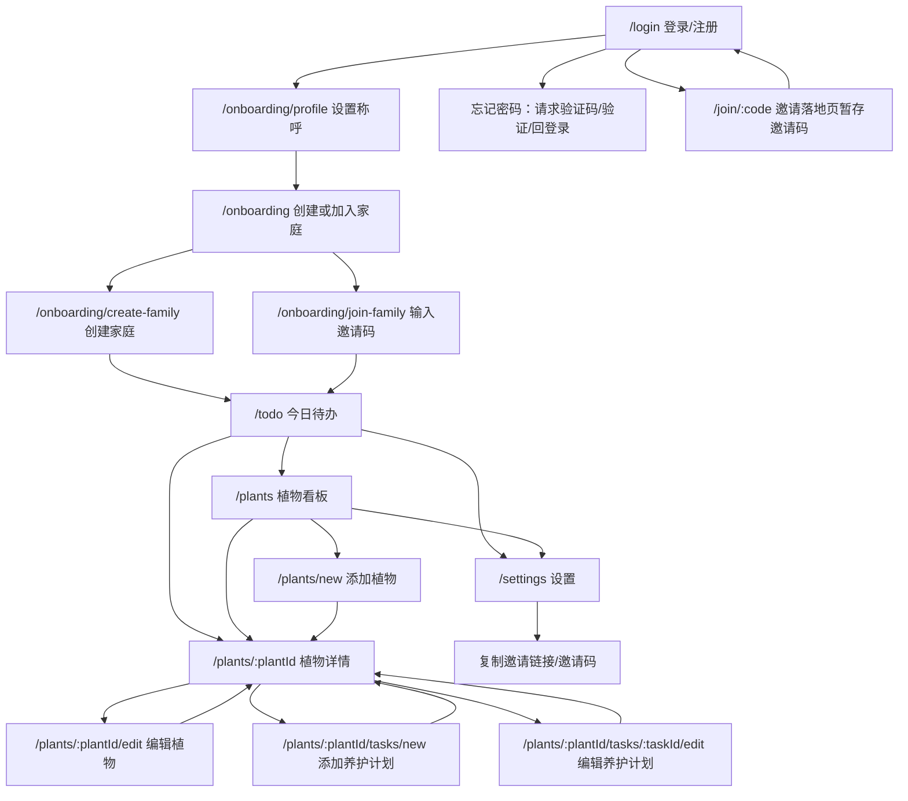

# Main Flow Continuity Plan

Date: 2026-06-17  
Scope: v0.6 主页面 UI 改造后的流程补全、状态补齐、功能清单细化。  
Design baseline: 继续沿用 2026-06-16 设计稿的轻量原生导航、GroupedSurface、photo-led、quiet form、family sync settings，不另起一套视觉语言。

## 1. 背景

当前主页面视觉已经完成一轮替换，但 UI 改造改变了局部页面结构：部分入口被合并，操作按钮位置变化，旧页面中的状态提示、返回路径、失败兜底和快捷操作没有全部被新结构承接。下一轮重点不是继续做单页美化，而是把主页面之间的衔接补顺。

本轮输出面向开发落地，应拆成可以逐项验收的小任务。每个任务必须同时说明：

- 从哪里进入该页面。
- 成功后去哪里。
- 用户取消、返回、失败、空数据、加载中时看到什么。
- 哪些功能入口必须保留，哪些只做视觉迁移。
- 需要补哪些测试或截图。

## 2. 主流程地图

## 3. Flow Contract

### 3.1 Auth Entry

登录/注册仍保持同页双模式，不拆成两个页面。新增或已出现的“忘记密码”必须成为正式流程：

- Request step: 输入邮箱，发送验证码。
- Verify step: 输入验证码和新密码。
- Success: 显示成功状态，自动回到登录模式，邮箱可保留。
- Failure: 未注册邮箱、验证码错误、验证码过期、网络失败必须有中文可读错误。
- Invite context: 用户从 `/join/:code` 来时，登录页底部邀请提示必须可见，登录/注册成功后继续加入家庭。

### 3.2 Family Access

onboarding 的二选一页面必须承接三种状态：

- Normal: 创建家庭 / 加入家人的家庭两个入口首屏可见。
- Pending invite: 检测到暂存邀请码时展示“正在接入家庭植物看板”，成功后进入 `/todo`。
- Failed invite: 清除暂存码，展示失败原因，并保留“手动输入邀请码”入口。

创建家庭和加入家庭页面必须有明确返回路径。成功状态不能停留在表单页，必须进入 `/todo` 或由 RouteGate 稳定放行。

### 3.3 Todo Home

待办首页是主入口，必须保留任务操作的完整性：

- Loading: 不只显示文本，应有与新设计一致的轻量骨架或状态 surface。
- Empty with no plants: CTA 指向 `/plants` 或 `/plants/new`，文案提示先添加植物。
- Empty with plants: CTA 指向植物看板，说明今天无需养护。
- Overdue / Today: 可完成，可撤销，完成后行级状态不抖动。
- Upcoming: 默认折叠数量明确，展开/收起按钮文案和图标一致。
- Open plant: 点击任务行非完成按钮区域进入对应植物详情。
- Bottom nav: 待办、植物、设置三项在主路径保持一致，不在二级页面显示。

### 3.4 Plant Board

植物看板必须作为植物集合入口，而不是单纯展示卡片：

- Header: 标题、数量、添加入口在 375px 不拥挤。
- Search: 支持名称、位置、简介；空搜索结果有清晰状态。
- Empty: 无植物时必须有添加第一株植物的主 CTA。
- Plant card: 整卡进入详情，编辑不抢主路径；无图/坏图有统一占位。
- Archive: 归档区默认折叠，不干扰主列表。
- Sync hint: 作为弱信息，不与任务或添加入口争抢。

### 3.5 Plant Detail

植物详情页是任务管理和植物档案的汇合页，必须补齐两个层级的操作：

- Primary: 需要处理的任务，完成和撤销。
- Secondary: 养护计划，添加、编辑、展开全部。
- Object summary: 植物图、名称、位置、任务状态要与顶部导航自然衔接。
- Archive state: 已归档植物不显示“需要处理”，但可查看档案和执行恢复/删除。
- Missing plant: 返回植物列表。
- Image preview: 点击有效图片打开预览，坏图不触发。
- Back path: 返回 `/plants`，不依赖浏览器历史。

### 3.6 Quiet Forms

添加/编辑植物与添加/编辑养护计划统一使用 quiet form 合同：

- Top: ScreenNav + 上下文摘要；标题不再使用大白条。
- Save: 成功后回到来源页，优先植物详情。
- Cancel/back: 无脏数据直接返回；有脏数据时弹确认。
- Validation: 输入端和提交端错误都显示在字段附近或表单级固定位置。
- Delete/archive: 危险操作从主保存动作中分离，使用 ConfirmSheet。
- Disabled state: 提交中按钮锁定，页面不跳动。

### 3.7 Settings And Invite

设置页必须承接家庭协作功能，而不是只作为账户菜单：

- InviteCard: 管理员可复制邀请链接和邀请码；非管理员能看权限说明和必要 fallback。
- Copy feedback: 成功显示“已复制”，失败显示可手动复制内容。
- Family name: 管理员可编辑，成功后设置页原位刷新。
- Members: 当前用户、角色、最后活跃信息稳定展示；管理入口如果未实现，必须显示为明确占位或移出。
- Notifications: 开关如果只是本地状态，必须在任务中标记为待接后端，不伪装为持久设置。
- Leave/sign out: 两个危险动作分开确认，文案区分退出家庭和退出登录。

## 4. Cross-Page State System

本轮补齐一个跨页面状态规范，所有页面至少覆盖：

- Loading: 轻量 surface 或 skeleton，禁止突兀纯文本。
- Empty: 说明当前没有什么，以及下一步去哪。
- Error: 错误来源可读，提供重试或返回。
- Success: 提交类操作有短反馈，并明确下一跳。
- Disabled/submitting: 按钮不可重复点击，焦点和文案可读。
- Long text: 继续遵守 v0.5 的长度和截断纪律。

## 5. Design Additions Needed

不需要立即再生成完整高保真图，但建议补 6 张小稿或实现级 wireframe：

- Auth forgot password two-step state.
- Invite landing page for `/join/:code`.
- Todo empty/loading/error state.
- Plant board empty/search-no-result state.
- Quiet form dirty-leave confirmation.
- Settings copy-failed manual fallback state.

这些稿件可以直接放在 `docs/design-docs/2026-06-16-system-ui-drafts/` 或新建 `2026-06-17-main-flow-continuity-states/`。

## 6. Execution Strategy

推荐按 v0.7 的任务顺序执行：

1. 先做 `FLOW-001` 路由与状态审计，确认实际问题清单。
2. 再做 Auth / Invite / Onboarding，因为它们影响进入系统。
3. 再做 Todo / Plant Board / Plant Detail，因为它们是主路径闭环。
4. 再做 Quiet Forms / Settings，因为它们承接管理与协作。
5. 最后做 E2E 和视觉回归，不在单页任务里零散验收。

## 7. Definition Of Done

- 每个主路径页面都有明确的进入、返回、成功、失败、空态、加载态。
- 登录、注册、忘记密码、邀请加入、创建家庭、加入家庭、添加植物、添加任务、完成任务、撤销完成、复制邀请链接这些功能全部有可测路径。
- 主页面底部导航只出现在一级页面；二级/表单页使用 ScreenNav。
- 所有新增或保留入口都有可访问名称。
- 375px / 390px / 430px 截图无文本遮挡、按钮溢出、卡片套卡片、白条贴片。
- `feature-list.json` 中 v0.7 任务能被独立领取和验收。
