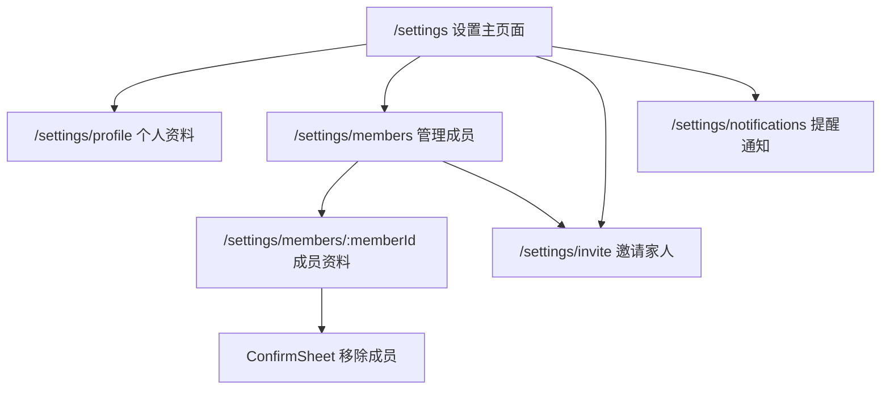

# Settings Detail Interaction Plan

Date: 2026-06-17  
Scope: 设置页 `07-settings-v2.png` 派生出的二级页面、弹层与缺失交互。  
Drafts: `docs/design-docs/2026-06-17-settings-detail-drafts/README.md`

## 1. 目标

设置主页面已经把信息架构改成家庭协作优先，但主页面上新增或强化的入口还缺对应的二级体验：

- 右上头像可点击，但还没有个人资料编辑页设计和交互合同。
- `管理成员` 有入口，但没有成员管理页、成员详情页和移除确认设计。
- InviteCard 有复制链接和邀请码，但复制失败、手动分享、从管理成员页继续邀请缺细节设计。
- 通知开关如果只是本地状态，需要有详情页说明当前能力边界，避免用户误解。

本方案把这些入口补齐为一组设置细节流，作为 v0.8 开发依据。

## 2. Information Architecture

建议路由都放在 `/settings/*` 下，保持设置域内的层级。若暂时不扩展 URL，也可以先用设置页内状态渲染子页面，但最终要保证返回路径和刷新恢复可控。

## 3. Page Contracts

### 3.1 个人资料 `/settings/profile`

入口：设置页右上头像。

功能：

- 展示当前头像和家庭内显示名称。
- 点击头像触发文件选择。
- 复用头像上传链路：HEIC 转 JPEG、上传 storage、保存 `imageStorageId`。
- 修改显示名称，保存到当前用户 profile。
- 上传失败保留原头像。

状态：

- Default: 当前头像/名称。
- Uploading: 头像区域显示上传中，保存按钮禁用或提示处理中。
- Saved: 显示短反馈，返回设置页后头像同步。
- Error: 上传失败、保存失败、名称为空或超长。
- Dirty leave: 有未保存名称时返回需确认。

视觉：

- 使用 `ScreenNav`。
- 圆形头像为页面主锚点，不使用植物图片式矩形。
- 表单区域保持 quiet form 密度。

### 3.2 管理成员 `/settings/members`

入口：设置页 `家庭成员` 分组右上 `管理成员`。

功能：

- 展示家庭名、成员数量和成员列表。
- 成员行展示头像、名称、角色、是否当前用户、最后活跃。
- 点击成员行进入成员资料。
- `邀请更多家人` 进入邀请页。

权限：

- 管理员可进入管理成员页。
- 普通成员如点击成员列表，只能进入只读成员列表或隐藏 `管理成员` 入口。建议 MVP 保持普通成员不显示管理入口，减少误会。

状态：

- Loading: 成员列表 skeleton 或轻量 surface。
- Empty abnormal: 理论上家庭至少有 1 人，若为空显示错误并返回设置。
- Error: 加载失败提供重试。

### 3.3 成员资料 `/settings/members/:memberId`

入口：管理成员页成员行。

功能：

- 展示成员头像、名称、角色、加入时间、最后活跃。
- 展示近期养护摘要。
- 管理员对非自己成员可执行 `移除该成员`。
- 管理员对自己不显示移除按钮，避免自移除与退出家庭语义冲突。

状态：

- Missing member: 成员不存在或已离开，返回成员列表。
- Remove submitting: ConfirmSheet 按钮提交中。
- Remove success: 关闭 sheet，返回成员列表并刷新。
- Remove failed: 在 sheet 内显示错误。

### 3.4 移除成员 ConfirmSheet

入口：成员资料页 `移除该成员`。

功能：

- 显示成员名和家庭名。
- 说明移除后该成员无法查看家庭植物和任务。
- 明确既有养护记录保留在家庭历史中。
- 确认后调用 `families.removeMember`。

限制：

- 不允许移除自己。
- 非管理员不能看到入口。
- 如果目标是唯一管理员或创建者，按后端规则给出友好错误。当前 MVP 可先不支持转让管理员。

### 3.5 邀请家人 `/settings/invite`

入口：

- 设置页 InviteCard `手动查看邀请码`。
- 管理成员页 `邀请更多家人`。

功能：

- 展示邀请码和完整邀请链接。
- 主按钮复制邀请链接。
- 次按钮复制邀请码。
- 复制失败时保留手动复制内容和失败说明。

状态：

- Copy link success: 按钮短暂显示 `已复制链接`。
- Copy code success: 次按钮短暂显示 `已复制邀请码`。
- Copy failed: 显示 fallback surface，包含邀请码和完整链接。

### 3.6 提醒通知 `/settings/notifications`

入口：设置页 `养护提醒通知` 行。

功能：

- 展示当前提醒开关。
- 如果当前只是本地状态，明确说明 `当前只保存到本机`。
- 提供 `检查浏览器通知权限` 和 `添加到主屏幕` 两个排障入口。
- 后续接入账号级 push subscription 后，再把开关改为真实持久设置。

状态：

- Permission unknown / granted / denied。
- Needs install: PWA 未安装时展示添加到主屏幕提示。
- Local only: 后端未接时必须明确说明。

## 4. Component Plan

- `SettingsSubPageNav`: 可直接复用 `ScreenNav`。
- `ProfileEditPage`: 消费头像上传和 profile 更新接口。
- `MemberManagementPage`: 消费 `getFamilySettingsSummary`。
- `MemberDetailPage`: 从 summary 中定位成员；后续可加单独 query。
- `InviteDetailPage`: 复用 InviteCard 复制逻辑，但展开完整链接和失败 fallback。
- `NotificationSettingsPage`: 先做本地状态说明，后续接 push subscription。
- `RemoveMemberConfirmSheet`: 复用 `ConfirmSheet` danger-solid。

## 5. Data And API

已有能力可复用：

- `users.generateAvatarUploadUrl`
- `users.getAvatarUrl`
- `users.updateMyAvatar`
- `families.getFamilySettingsSummary`
- `families.removeMember`
- `families.renameFamily`
- `families.leaveFamily`

可能需要补齐：

- `users.updateMyProfile` 或等价 mutation，用于修改当前用户显示名称。
- `families.getMemberDetail` 可选。MVP 可先从 settings summary 取成员。
- `notifications.getNotificationCapability` 可选。MVP 可先用前端能力检测。

## 6. Acceptance Criteria

- 设置主页面上每一个可点击入口都有对应页面或 sheet。
- 右上头像进入个人资料编辑，头像和名称都可保存。
- `管理成员` 进入成员管理，不再是无交互文案。
- 成员行可进入成员资料，管理员可移除非自己成员。
- 邀请复制失败有手动复制兜底。
- 通知页明确本地状态和后续持久化边界。
- 二级页不显示底部 TabBar；设置一级页保留 TabBar。
- 375px / 390px / 430px 无横向溢出、按钮遮挡、文本压缩。

## 7. Recommended Build Order

1. 路由与设置子页面壳。
2. 个人资料编辑页。
3. 成员管理列表。
4. 成员资料与移除确认。
5. 邀请详情和复制失败 fallback。
6. 通知详情页。
7. 设置主页面入口接线与回归截图。
